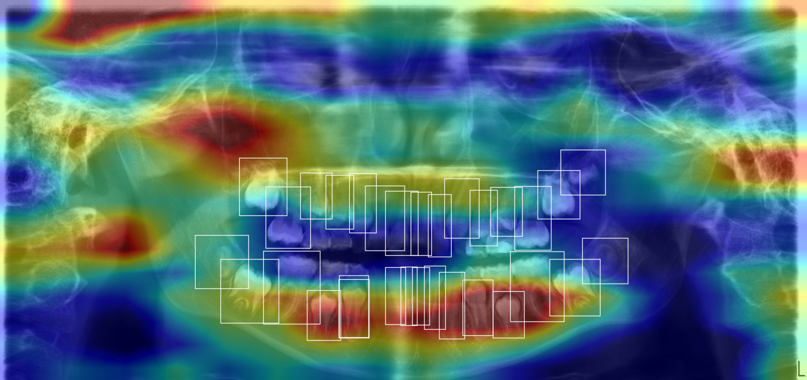
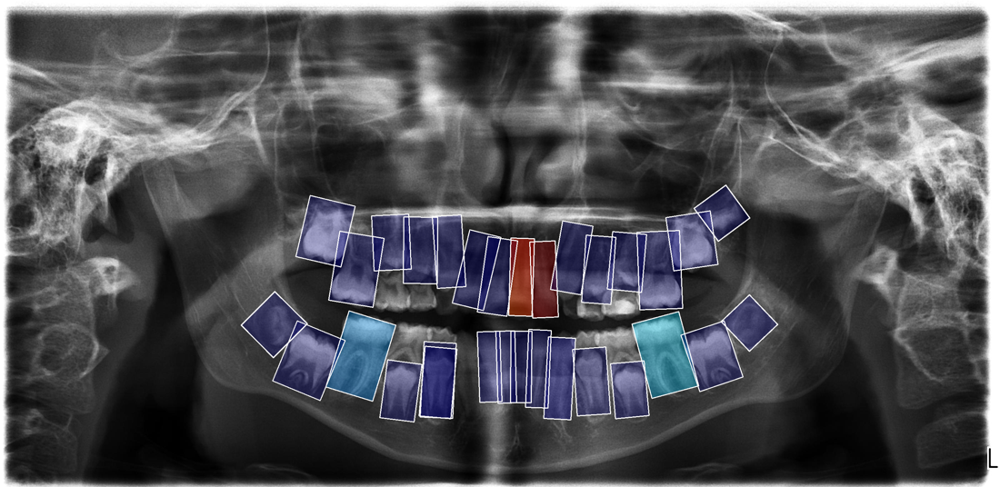

# HMA-Net - final model code, parameters and weights

Companion release for the manuscript *Incremental information auditing reveals non-incremental
anatomical inputs in dental age and sex estimation*.

## Contents

```
train.py                         training entry point (two-phase fine-tuning, early stopping)
hma_net/hma_net.py               model, losses, dataset and evaluation (self-contained)
config/parameters.json           every parameter of the reported configuration
figures/                         Grad-CAM scripts and the two panels of Fig. 6b
data_sample/                     three de-identified sample cases and the label format
weights/                         tooth detector weights (see weights/LICENSE for terms)
requirements.txt, CITATION.cff, LICENSE
```

## Install

```bash
pip install -r requirements.txt
```

## Model weights

The HMA-Net checkpoint reported in the paper is attached to the latest release:

```
https://github.com/yingziyejiang/HMA-Net/releases/latest
file:  hma_net_best_age.pt
md5:   37d0b2308b6cb53e37d30d4dc0578cdd
```

Licence: MIT, research use only - not for clinical diagnosis, treatment decisions, age assessment
of minors, or forensic or immigration procedures (see `weights/LICENSE`).

```python
import torch, sys
sys.path.insert(0, 'hma_net')
from hma_net import HMAAgePredictor

model = HMAAgePredictor().eval()
ck = torch.load('hma_net_best_age.pt', map_location='cpu')
print(model.load_state_dict(ck['model_state_dict'], strict=False))
# _IncompatibleKeys(missing_keys=[], unexpected_keys=['decorr_proj.weight', 'decorr_proj.bias'])
# decorr_proj belongs to the decorrelation term of the audited L2 jaw stream, which is disabled in
# the released configuration. It is not used at inference and can be ignored.
```

The model expects one batch dict: `img` (B,3,256,256), `teeth` (B,32,3,64,64), `pos_bbox` (B,32,4),
`fdi` (B,32), `mask` (B,32). It returns `(age_pred, gender_logit, coral_logits)`; sex probability is
`sigmoid(gender_logit)`.

## Train

```bash
python train.py --manifest manifest.csv --outdir runs/hma_net
```

The manifest CSV needs the columns `img_path,label_path,age,gender,split` and per-tooth label files
in the format described in `data_sample/README.md`. Protocol of the reported run: Adam, 15 frozen-
backbone epochs at lr 1e-3 then full fine-tuning at lr 1e-4, lr halved every 20 epochs, batch size 32
with a gender-balanced sampler, best validation score per head, early stopping after 30 stale epochs.

## Data

The clinical cohort (4,293 orthopantomograms, ages 3-18 years) is **not** distributed here; the
manuscript states how it can be requested. The three cases in `data_sample/` are de-identified and
included with permission for illustration and smoke-testing only.

## Detector

`weights/tooth_detector_yolov8m_obb.pt` - YOLOv8m-OBB, 52 FDI classes, mAP@50 0.9765,
md5 `1bcbb900f5fc5179454114c23bc1f025`. Inference settings used throughout: confidence 0.25, NMS IoU
0.7, max_det 300, imgsz 1024; where a tooth is detected more than once at the same FDI position, the
highest-confidence box is kept. Licence: AGPL-3.0 (see `weights/LICENSE`).

```python
from ultralytics import YOLO
m = YOLO('weights/tooth_detector_yolov8m_obb.pt')
res = m(image_path, conf=0.25, iou=0.7, max_det=300, imgsz=1024)[0]
# res.obb.cls -> FDI class index, res.obb.xywhr -> oriented boxes, res.obb.conf -> confidence
```

## Grad-CAM attribution (Fig. 6b)





The panoramic stream (L1) spreads heat over broad craniofacial regions; the per-tooth stream (L3)
localises it on individual teeth, normalised globally across all teeth so that per-tooth intensities
are comparable.

```bash
python figures/gradcam_l1_panoramic.py --checkpoint hma_net_best_age.pt --list-layers
python figures/gradcam_l1_panoramic.py --checkpoint hma_net_best_age.pt --image opg.jpg \
    --rois data_sample/labels_obb5/000006934.txt --stream both --outdir out
python figures/gradcam_l3_per_tooth_globalnorm.py --checkpoint hma_net_best_age.pt --image opg.jpg \
    --rois data_sample/labels_obb5/000006934.txt --fdi 46,36 --stream l3 --target sex
```

`--rois` takes either a `labels_obb5` text file (`fdi cx cy w h angle_deg`) or a `.npy` array of
shape (N, 5) with `fdi x1 y1 x2 y2` in pixels. Outputs are `<name>_l1_<target>.png` and
`<name>_l3_<target>.png`.

## Feature-space t-SNE

figures/e09_tsne_age_sex.png (script figures/e09_tsne.py) shows the panoramic (L1), per-tooth (L3)
and fused representations of the 657-subject test split, coloured by chronological age (top row) and
by sex (bottom row). Perplexity 30, seed 0; features are taken from the released checkpoint with
forward hooks (after the panoramic encoder, after graph aggregation for the tooth stream, and after
FiLM fusion); the tooth stream is represented by its per-tooth features.
The fused space orders age most strongly and separates the two sexes most clearly.

## The input audit

For a candidate input `X_new` added to a set of retained inputs `X_retained`, the incremental
predictive utility for task `t` is

    delta-U_t = P_t(X_retained + X_new) - P_t(X_retained)

An input is retained for a task only where the increment is positive for that task. Applied to OPGs,
the audit rejected a jaw-crop stream and the 20 deciduous tooth classes, and retained the panoramic
and permanent-tooth streams for both age and sex.

## Citation

See `CITATION.cff`.

## Licence

The code is MIT (`LICENSE`). The detector weights are AGPL-3.0; the HMA-Net checkpoints are MIT with
a research-use-only restriction. Details in `weights/LICENSE`.
